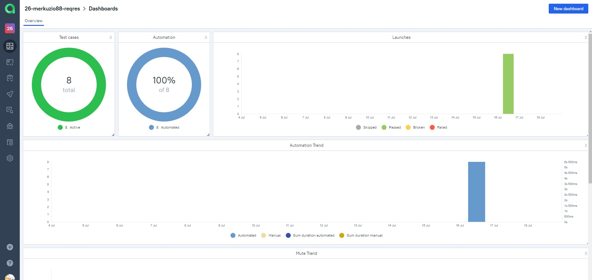

# API tests for [Reqres.in](https://reqres.in/)

---


<a href="https://reqres.in/"></a>

---


## Content:

- <a href="#tools">Tools and technologies</a>
- <a href="#facts">Project features</a>
- <a href="#scenarios">Test scenarios</a>
- <a href="#cli">Launch from the CLI</a>
- <a href="#jenkins">CI/CD with Jenkins</a>
- <a href="#allure">Allure reporting</a>
- <a href="#allure-testops">Integration with Allure TestOps</a>
- <a href="#jira">Integration with JIRA</a>
- <a href="#telegram">Bot notifications in Telegram</a>


<a id="tools"></a>
## Tools and technologies
<p align="center">
<a href="https://www.jetbrains.com/idea/"></a>  
<a href="https://www.java.com/"></a>  
<a href="https://rest-assured.io/"></a>  
<a href="https://github.com/"></a>  
<a href="https://junit.org/junit5/"></a>  
<a href="https://gradle.org/"></a>
<a href="https://github.com/allure-framework/allure2"></a>
<a href="https://qameta.io/"></a>   
<a href="https://www.jenkins.io/"></a>  
<a href="https://www.atlassian.com/ru/software/jira/"></a>
</p>

<a id="facts"></a>
## Project features
* Request/response specifications
* Custom `tpl` templates for `Allure` report logging
* Test cases as a documentation with `Allure TestOps`
* Launch all or separate tests from TMS directly
* `JIRA` integration
* Telegram notifications

<a id="scenarios"></a>
## Test Scenarios
* [x] Checking the successful getting of a user
* [x] Checking the successful deleting of a user
* [x] Checking the successful creation of a new user
* [x] Checking the unsuccessful creation of a new user with Bad Request error
* [x] Checking the successful user update with put method
* [x] Checking the unsuccessful user update with put method and Bad Request error
* [x] Checking the successful user update with patch method
* [x] Checking the unsuccessful user update with patch method and Bad Request error


<a id="cli"></a>
##  Launch from the CLI

All tests can be executed by command:
```bash  
./gradlew clean test
```


<a id="jenkins"></a>
## </a><a name="CI/CD with Jenkins"></a>CI/CD with [Jenkins](https://jenkins.autotests.cloud/job/26-merkuzio88-reqres/)</a>
 

### Jenkins job

- `COMMENT` parameter (by default @asolqa is tagged)

After the build is done the test results are available in `Allure`, `Allure TestOps` and `JIRA`

<a id="allure"></a>
## </a> <a name="Allure"></a>Allure [reporting](https://jenkins.autotests.cloud/job/26-merkuzio88-reqres/8/allure/#)</a>
 

`Allure` report includes request and response logging beautified with `tpl` templates:


<a id="allure-testops"></a>
## </a> Integration with <a target="_blank" href="https://allure.autotests.cloud/project/4325/dashboards">Allure TestOps</a>

`Allure TestOps` processes tests as a documentation and allows to launch them directly from TMS.

Here all test cases execution results are available.

Dashboard contains test runs statistics:


All test cases:


To execute tests from TestOps move to <a target="_blank" href="https://allure.autotests.cloud/project/4325/jobs">Jobs</a>:


Click to run Job, select needed/all items and submit launch:


Launches:


<a id="jira"></a>
## </a> Integration with <a target="_blank" href="https://jira.autotests.cloud/browse/HOMEWORK-1299">Jira</a>

`Jira` has information about all related test cases, their statuses and launches results from `Allure TestOps`:


<a id="telegram"></a>
## </a> Bot notifications in Telegram
After every build Telegram bot sends notification with `Allure` report:

 


